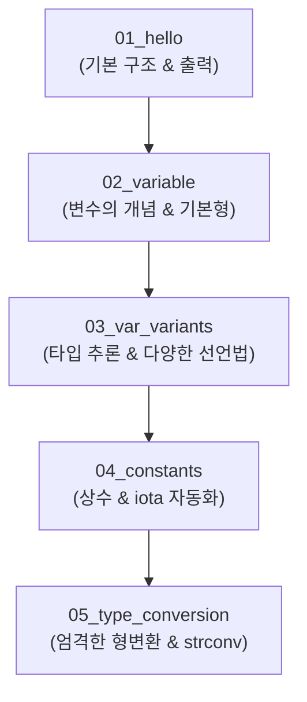

# 📝 Go 프로그래밍 부트캠프: 1일차 강의 보고서

- **작성자**: 부트캠프 강사
- **강의 주제**: Go 언어 기초 (개발 환경 구성, 변수와 상수, 자료형 및 형변환)
- **대상**: Go 언어 입문자 및 프로그래밍 초심자
- **문서 목적**: 1일차 강의 진행 내용 아카이빙, 학생들의 핵심 학습 포인트 분석, 강사용 티칭 가이드 정리

---

## 🗺️ 1일차 전체 커리큘럼 로드맵

1일차 수업은 프로그래밍 언어의 가장 기초가 되는 **구문(Syntax), 메모리 저장(변수와 상수), 그리고 데이터의 흐름과 연산(형변환)**을 다루었습니다. Go 언어의 특징인 **엄격함(Strict Typing)**과 **단결함(Simplicity)**을 학생들이 체득할 수 있도록 단계별로 예제를 구성했습니다.



---

## 🔍 상세 학습 단원 분석

### 1. `01_hello` - Go 프로그램의 첫 걸음
* **학습 목표**: Go 프로그램의 기본적인 구조를 이해하고 화면에 텍스트를 출력할 수 있다.
* **핵심 개념**:
  * `package main`: 실행 파일(Entry Point) 생성을 위한 필수 선언.
  * `import "fmt"`: 표준 입출력 포맷(fmt) 라이브러리 탑재.
  * `func main()`: 프로그램 실행 시 최초로 호출되는 진입점 함수.
  * `fmt.Println()`: 콘솔 출력 및 자동 줄바꿈.

#### 💻 핵심 코드
```go
package main

import "fmt"

func main() {
    fmt.Println("Hello World")
}
```

> [!TIP]
> **👨‍🏫 강사 코멘트 (티칭 팁)**
> - 코드가 실행되기까지 컴파일러가 왜 `main` 패키지와 `main` 함수를 요구하는지 설명하는 것이 중요합니다.
> - C/C++나 Java와 달리 Go는 문장 끝에 세미콜론(`;`)을 붙이지 않는 규칙이 있다는 것을 가볍게 언급해 주면 다른 언어 유경험자들의 오타율을 줄일 수 있습니다.

---

### 2. `02_variable` - 변수 선언과 기본 데이터 타입
* **학습 목표**: 변수의 필요성을 인식하고, 기본 네 가지 타입의 선언 및 값 대입 방법을 익힌다.
* **핵심 개념**:
  * **변수 선언 정석**: `var 변수명 타입 = 값`
  * **4대 기본 데이터 타입**:
    * `int`: 정수 (Integer)
    * `float64`: 소수점을 가진 실수 (Floating Point)
    * `string`: 문자열 (반드시 큰따옴표 `""` 사용)
    * `bool`: 논리형 (`true` / `false`)
  * **대입 연산자 (`=`)**: 오른쪽 값을 왼쪽 변수에 채워 넣는 개념.

#### 💻 핵심 코드
```go
var age int = 20
var height float64 = 175.5
var name string = "홍길동"
var isStudent bool = true

// 값의 변경 (var와 타입 생략)
age = 21
isStudent = false
```

> [!NOTE]
> **💡 입문자를 위한 비유법**
> - **변수**는 값을 저장하는 **이름표가 붙은 바구니**로 비유하면 효과적입니다.
> - **타입**은 **바구니의 크기와 종류**입니다. 정수 바구니(`int`)에는 정수만 담아야 하고, 실수 바구니(`float64`)에는 실수만 담아야 한다는 원칙을 인지시킵니다.

---

### 3. `03_var_variants` - 다양한 변수 선언법과 기본값
* **학습 목표**: Go의 편리한 변수 선언 문법을 이해하고, 초깃값이 없을 때 할당되는 '기본값(Zero Value)'을 파악한다.
* **핵심 개념**:
  * **타입 추론**: 타입을 명시하지 않아도 대입값의 성질을 보고 Go가 알아서 타입을 매핑 (`var name = "이순신"`).
  * **단축 변수 선언 (`:=`)**: `var`와 타입 선언을 생략하여 간결하게 선언 (※ 함수 내부에서만 사용 가능!).
  * **서식 지정자 (`%T`, `%v`)**: `fmt.Printf`를 사용한 변수의 값과 타입 검사.
  * **다중/그룹 선언**: 여러 변수를 동시 선언하거나 괄호로 묶어 가독성을 높이는 방법.
  * **기본값 (Zero Value)**: 값을 대입하지 않고 선언만 했을 때 주어지는 기본 데이터 (`int` → `0`, `string` → `""`, `bool` → `false`).

#### 💻 핵심 코드
```go
// 1. 타입 추론 & 서식 출력
var score = 95.5
fmt.Printf("값: %v, 타입: %T\n", score, score) // float64

// 2. 단축 변수 선언
city := "Seoul" 

// 3. 다중 선언 및 그룹 선언
x, y, z := 10, "Hello", true
var (
    company = "Google"
    rank    = 1
    isOpen  = false
)

// 4. 기본값(Zero Value)
var defaultInt int       // 0
var defaultFloat float64 // 0
var defaultString string // ""
var defaultBool bool     // false
```

> [!IMPORTANT]
> **⚠️ 학생들이 자주 하는 실수**
> - **단축 선언 (`:=`)의 범위 제한**: 함수 밖(전역/패키지 레벨)에서 `:=`를 쓰려다가 컴파일 에러를 만나는 학생이 매우 많습니다. "함수 내부에서만 쓸 수 있는 단축 통행증"임을 명확히 지도해야 합니다.
> - **재선언 에러**: 이미 선언된 변수에 단축 선언(`:=`)을 다시 사용하면 에러가 발생합니다. (기존 변수의 값 변경은 오직 `=`만 사용).

---

### 4. `04_constants` - 불변의 상수와 iota
* **학습 목표**: 불변의 데이터(상수)를 정의하는 방식을 배우고, `iota` 키워드를 사용해 가독성 높은 코드를 작성한다.
* **핵심 개념**:
  * `const`: 선언 후 절대 변경 불가능한 고정값. 프로그램의 안정성을 보장.
  * **그룹 상수 선언**: 연관성이 높은 데이터들을 묶어서 관리.
  * `iota`: 0부터 시작하여 행이 바뀔 때마다 1씩 증가하는 자동 번호표 생성기.
  * **타입이 없는 상수(Untyped Constant)**: 타입이 미리 고정되지 않아, 할당받는 변수의 타입에 따라 유연하게 동작.

#### 💻 핵심 코드
```go
const unchangeableConst = "변경 불가"
// unchangeableConst = "에러 유발" // 컴파일 에러!

// iota를 활용한 자동 번호표
const (
    Apple  = iota // 0
    Banana        // 1
    Grape         // 2
)

// 타입 없는 상수의 유연함
const maxCount = 100
var currentCount int = maxCount     // int로 적용
var currentPrice float64 = maxCount // float64로 적용
```

---

### 5. `05_type_conversion` - Go의 엄격한 형변환과 strconv
* **학습 목표**: Go의 강타입(Strong Typing) 특성을 이해하고 다른 자료형 간의 안전한 변환 방법을 배운다.
* **핵심 개념**:
  * **강타입 특성**: Go는 서로 다른 타입(예: `int`와 `float64`) 간의 덧셈이나 비교 연산을 원천 금지합니다.
  * **명시적 형변환**: `타입명(변수)` 형태의 수동 형변환 필수.
  * **실수 → 정수 변환**: 소수점 이하는 반올림되지 않고 완전히 '버림(Truncate)' 처리됨.
  * `strconv` 패키지: 문자열("123")과 숫자(123) 간의 변환을 위한 특수 패키지.
    * `strconv.Itoa()` (Integer to ASCII): 숫자를 문자열로 변환.
    * `strconv.Atoi()` (ASCII to Integer): 문자열을 숫자로 변환 (실패할 가능성이 있으므로 항상 **에러(`err`)**를 동반 반환).

#### 💻 핵심 코드
```go
// 1. 숫자 간 명시적 형변환
var a int = 10
var b float64 = float64(a)

// 2. 다른 타입 간 연산 시 형변환
var x int = 10
var y float64 = 20.5
res := float64(x) + y

// 3. strconv 패키지를 활용한 문자열 변환
str := strconv.Itoa(123) // "123"

num2, err := strconv.Atoi("456")
if err == nil {
    // 성공 시 로직
}
```

> [!WARNING]
> **🚨 핵심 주의 구간**
> - Go에서 `strconv.Atoi`를 학습할 때 처음으로 **다중 반환값(Multiple Return Values)**과 **에러 핸들링 패턴**을 접하게 됩니다.
> - `err != nil`을 통한 Go 특유의 명시적 예외 처리 방식을 충분히 연습시켜야 향후 뒷단에 나올 파일 입출력, 네트워크 프로그래밍 등에서 헤매지 않습니다.

---

## 📈 1일차 강의 종합 평가 및 피드백

### 👍 잘된 점 (Positive Points)
1. **쉬운 비유를 통한 장벽 완화**: 변수를 "바구니", `iota`를 "자동 번호표", `strconv`를 "전문 도구상자", 타입 없는 상수를 "만능 열쇠" 등으로 주석에 잘 녹여내어 초보자들의 심리적 진입 장벽을 대폭 낮춤.
2. **점진적 난이도 조절**: 단순 Hello World 출력에서 시작해, 변수 → 변형 선언 → 상수 → 엄격한 형변환 및 라이브러리(`strconv`) 활용으로 빌드업이 매끄럽게 설계됨.

### 🎯 강의실 내 피드백 예상 & 대응 전략
- **Q. "왜 다른 언어와 달리 `int + float64` 연산이 자동으로 안 되나요?"**
  - **A (강사 가이드)**: "자동 형변환(Implicit Conversion)은 간편해 보이지만 나중에 원인을 찾기 힘든 버그를 만듭니다. Go는 '명시적인 것이 암시적인 것보다 훨씬 안전하다'는 철학을 갖고 있어, 개발자가 직접 확인하고 승인하도록 강제합니다."
- **Q. "문자열을 숫자로 바꿀 때 왜 `int("123")`은 안 되나요?"**
  - **A (강사 가이드)**: "숫자 10과 10.5는 둘 다 숫자라서 서로 쉽게 옷을 갈아입힐 수 있습니다. 하지만 글자 `"123"`은 단순한 그림 파일과 같습니다. 그림을 컴퓨터가 이해할 수 있는 값으로 해석하려면 전문 판독기인 `strconv`가 필요합니다."

---

## 🔮 2일차 예고 (Next Level)

다음 2일차 수업에서는 오늘 배운 데이터 타입과 기본 메모리 제어를 기반으로, 프로그램의 흐름을 조절하는 **조건문(if, switch)과 반복문(for)**, 그리고 데이터를 더 묶어서 관리하는 **배열(Array)과 슬라이스(Slice)**에 대해 학습할 예정입니다.
오늘 배운 `bool` 타입과 형변환 지식이 조건문 영역에서 아주 중요하게 작용할 것임을 언급해 주시면 유기적인 학습에 큰 도움이 될 것입니다.
